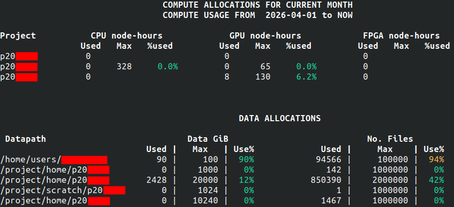

{ width="640" .off-glb }

# Hands-on: Configuring your access to MeluXina

This part will help you to configure your access to MeluXina.
It consists of three main steps:

1. [Setup your **service desk** account](#setup-your-service-desk-account)
2. [**Command line** access using SSH](#command-line-access-using-ssh)
3. [**Web-portal** access](#web-portal-access)

{ width="460"}
{ width="460"}

---

## ▶️ Setup your service desk account

{ width="520" align="right" }

If this is the first time that you're accessing MeluXina, you have received an email with your login information.
This email with subject "New LuxProvide Account" (example on the right) includes two important pieces of information to set up your account:

- Your **account username**, in the format `u10XXXX`
- Your **token** (temporary password), in the format `123456`

Then, you have to follow the **link in the email**, use your temporary credential to login and setup a new strong password. Make sure to remember your username and this password as you will need them later on.

??? abstract "Online Documentation"

    - [Get your service desk password](https://docs.lxp.lu/first-steps/connecting/#get-your-service-desk-password)


---

## ▶️ Command line access using SSH

!!! info "SSH setup is not strictly required, but recommended"

    The command line interface is often required to use MeluXina.
    
    If the SSH access is too complicated to setup, you can jump directly to the [web-portal access](#web-portal-access) and use the command line from there.

The Command Line Interface (CLI) with Secure Shell (SSH) is the de-facto standard to access remote Linux machines and supercomputing platforms. 
It is fast, lightweight, and secure. The security relies on an SSH key pair (public/private keys) which is tied to a specific machine (e.g., your laptop) which can be granted (or not) access to the supercomputer.

### Setup of SSH Access

Configuring your SSH access to MeluXina requires the following steps that have to be done once for all:

1. [Generating an SSH key](https://docs.lxp.lu/first-steps/connecting/#generating-an-ssh-key-pair)
2. [Uploading your public SSH key](https://docs.lxp.lu/first-steps/connecting/#upload-your-public-ssh-key)

!!! tip

    This setup is slightly different depending on if you work on Linux/MacOS or Windows.
    In the documentation page, make sure to check the instructions specific to your system by clicking on the right tab. 
    
    For example, if you use Windows:
    
       

??? warning "Guidelines to Handle Your SSH Keys"

    Handling SSH Keys can be confusing and intimidating at first.
    It is about security and it should be taken seriously when all the devices are connected to the Internet. Here are a few guidelines:

    - The term "pair of SSH keys" refers to the **public and private keys** associated together.
    - The private key is meant to be **private**: Never share it with anyone! Don't send it by email! (not even to yourself) Don't put it on a Cloud drive (Dropbox, Google Drive, MS OneDrive, etc.).
    - Generate one pair of keys for each of your `account@machine`. Don't try to copy your keys around. It makes it easier to block an access if it gets compromised.
    - Protect your SSH key with a passphrase. Without that, if your laptop gets stolen, your accesses to remote machines get compromised too! Instead, learn to use SSH Agent so you need to type your passphrase only once after booting your laptop.
    - You're not allowed to share your HPC access with another person. If you need to do it for some reason (e.g. debugging issues specific to your account), you should NOT share your private SSH key. Instead, you should authorize the SSH public of the other person to access your account (via the service desk or your `~/.ssh/authorized_keys`)

??? abstract "Online Documentation"

    - [Generating an SSH key](https://docs.lxp.lu/first-steps/connecting/#generating-an-ssh-key-pair)
    - [Uploading your public SSH key](https://docs.lxp.lu/first-steps/connecting/#upload-your-public-ssh-key)

### Connection to the MeluXina login node

When using a supercomputer, you will usually first connect to a **login** or **access node**.
From this machine, you can check your files, disk quota, and computing usage.
It is intended to be used by the user to prepare computing jobs and scripts and then submit them to the job scheduler.


??? question "About the access nodes"

    Because the access node is shared by all the users of the platform, it should not be used to compile and install your software and it should definitely not be used to run any memory or computing-intensive task. Usually, there are some guardrails implemented on the access node to prevent unwanted usage. For example, there is no compiler installed or the `module` command is not available.

You're now ready to connect to MeluXina. Follow the detailed instructions of the documentation:

- [Connect to MeluXina](https://docs.lxp.lu/first-steps/connecting/#connect-to-meluxina)

!!! tip

    Once again, this step is slightly different depending on if you work on Linux/MacOS or Windows.
    In the documentation page, make sure to check the instructions specific to your system by clicking on the right tab. 
    
    For example, if you use Windows:
    
       


If you have configured your SSH config file with an alias (recommended), you can simply connect with:

```bash
ssh meluxina
```

??? question "What does this mean?"

    In the example above, `meluxina` does not name a specific machine.
    Instead, it refers to an entry in the SSH config file that defines a set of configuration items, like the **hostname** (actual address on the internet),
    the **port** of the SSH service and your **username**, so you don't need to remember them and enter them every time.


If the connection is successful, you should see the MeluXina welcome banner:

{.center}

The shell prompt (last line on the terminal) should indicate that you're correctly connected to the MeluXina login node (`login02` or `login03`) as the user `u10XXXX`.


??? failure "Failing to connect?"

    If you fail to connect, don't panic! Instead look for clues that would indicate the reason of the failure:

    1. Any error message? Check carefully all the output lines on your terminal, and try to address the first one.
    2. Need more information from SSH? Add the `-v` option (like verbose) after the `ssh` command. That will give you more details about the connect process. You can add more `v` to get more detailed messages.
    3. Call for help! 👨‍🏫 The LuxProvide team will help you get this right. 🙂

You made it! You're connected to the MeluXina supercomputer.

??? abstract "Online documentation"

    - [Connect to MeluXina](https://docs.lxp.lu/first-steps/connecting/#connect-to-meluxina)

### Testing the command line

This training will not teach you how to use the command line. Nevertheless, there are a few commands that you can easily try. Just type one of the following command and then `Enter` to see the output.

- Who are you? `whoami`, `echo $USER`, `id` 
- What time is it? `date`
- On what computer are you? `hostname`, `uname -a`, `lsb_release -a`
- Where are you on the computer? `pwd`
- What are the files in your home directory? `ls $HOME`

One of the important commands you need to know on MeluXina is `myquota`. It shows the **compute and data allocations** for each of your projects.

{.center}

That's it for now. The submission of computation jobs on MeluXina will be shown in the [next part](urban_wind_simulation.md) of the training. You can leave your command line session using the `exit` command. 

??? abstract "Online documentation"

    - [Basic Linux](https://docs.lxp.lu/first-steps/basic_linux/)

---

## ▶️ Web-portal access

The Open OnDemand web portal provides a graphical interface to access MeluXina services.
It serves as a web-based gateway to the high-performance computing (HPC) environment, allowing users to seamlessly access the command line, manage files, monitor jobs, and run graphical applications directly from a browser without needing to configure SSH locally.

Follow these steps to access the **MeluXina Open OnDemand web-portal**:

1. Open the url of the web-portal: [**https://portal.lxp.lu/**](https://portal.lxp.lu/). 
2. Enter your **username** (`u10XXXX`) and **password** (set during [onboarding](#setup-your-service-desk-account))
3. If you have enabled **2FA**, you'll be prompted for a one-time code

{.center width="720"}

??? abstract "Online documentation"

    - [How to connect to Open Ondemand](https://docs.lxp.lu/web_services/open_ondemand/howtoconnect/)
    - [Multi-factor authentication setup](https://docs.lxp.lu/web_services/keycloak/)

Upon successful login, you'll land on the Open OnDemand Welcome page with access to:

- **Shell Access**: Terminal interface.
- **Home Directory**: Browse and manage files.
- **Active Jobs**: Monitor your jobs.
- **Desktop**: Run a full desktop environment on a compute node.
- **Graphical applications**: Run GUI applications directly from the portal.

{.center width="720"}

### Testing the web-portal

Let's test some basic features of the Open OnDemand portal for MeluXina.

{ align="left" width="100" .off-glb }
<br>The command line interface can be accessed by clicking the **Shell Access** icon. 
It opens a new tab with a command line interface to the MeluXina login node.
It offers similar possibilities to the [Command line access using SSH key](#command-line-access-using-ssh) that you have seen before. You can try the `myquota` command or one of the other [commands listed earlier for testing](#testing-the-command-line).<br><br>

{ align="left" width="100" .off-glb }
<br>The **Home Directory** application allows you to explore the files in your home directory. Your project directories are also visible on the left column. You can navigate through your directories, view, download and upload files on your storage space of MeluXina.<br><br><br>

{ align="left" width="100" .off-glb }
<br>The **Active Jobs** application displays your computation jobs currently running on MeluXina. This also includes the ones you started from the command line interface. For privacy reason, you cannot see the jobs of the other users.<br><br><br>

Other applications will be used in the following parts of the training. In the [Urban wind simulation and visualization](urban_wind_simulation.md), you will use the **ParaView** application to visualize the result of your simulation. In the [PyTorch notebooks with JupyterLab](pytorch_notebooks.md), you will start a **JupyterLab** on a compute node to perform an deep learning training and finetuning with PyTorch.

---

[{ width="420" }](https://epicure-hpc.eu/) 
[{ width="320" }](https://luxprovide.lu)
