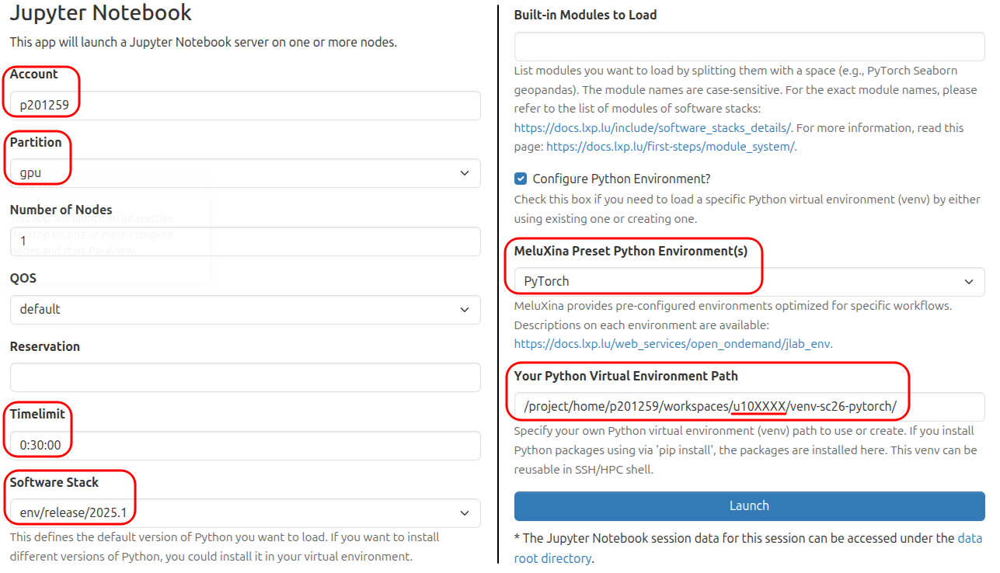
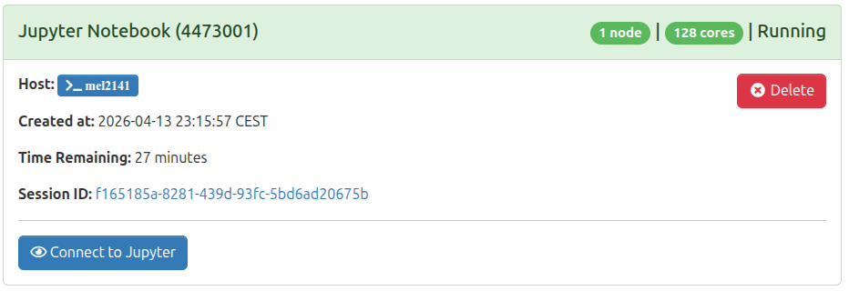
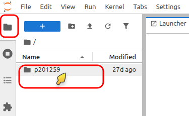
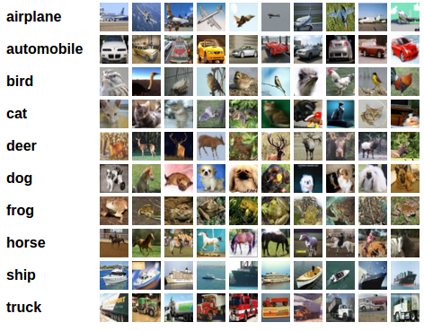
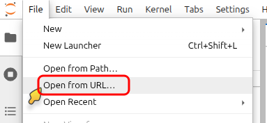
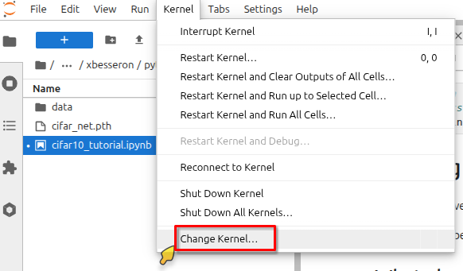
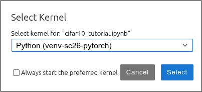

{ width="640" .off-glb }

#  Hands-on: PyTorch notebooks with JupyterLab

{align="right" width="320"}

In this part, you will get familiar with running Jupyter notebooks on the MeluXina HPC system. We will guide you through setting up the environment, i.e., running your JupyterLab instance on a compute node and execute the code from within the browser. The examples below focus specifically on **PyTorch notebooks**, which have been taken directly from the [official PyTorch tutorials](https://docs.pytorch.org/tutorials/index.html) to demonstrate practical deep learning workflows on our infrastructure.


---

## ▶️ Running JupyterLab

Similar to ParaView, JupyterLab is started from the MeluXina web-portal, allowing you to use the Jupyter interface from your local browser. 

👉 Start the MeluXina web-portal: [**https://portal.lxp.lu/**](https://portal.lxp.lu/). 

!!! tip

    If needed, follow the instructions of the [previous part](connections_meluxina.md):
    
    - [Web-portal access](connections_meluxina.md#web-portal-access)

👉 Open the **Jupyter Notebook** application.

1. Click on the [Jupyter Notebook application on the web-portal](https://portal.lxp.lu/pun/sys/dashboard/batch_connect/sys/bc_meluxina_jupyter/session_contexts/new).
2. Use the settings defined below and click the **Launch** button.

    {.center}
    !!! warning "Your Python Virtual Environment Path"
    
        The setting "Your Python Virtual Environment Path" define a path to your own Python virtual environment (`venv`), new or existing. You should set it to a path where you have write permission.
        
        You can use the value `/project/home/p201259/workspaces/u10XXXX/venv-sc26-pytorch/` making sure to replace `u10XXXX` by your own username.

3. Wait for job to run and then click the **Launch Jupyter Notebook** button as shown below.
{.center}

You now have JupyterLab software running on a MeluXina compute node.
You can use it to import and execute Jupyter Notebook (in Python, R, Julia, etc.) or develop your own.

Before opening any notebook, let's change to working directory. To avoid any conflict with the other users of the same project, we can create our working directory in `/project/home/p201259/workspaces/u10XXXX/pytorch_notebooks/` ( replace `u10XXXX` by your own username).

👉 Set your working directory in JupyterLab

1. In the JupyterLab file browser at the top left, navigate to `/p201259/workspaces/u10XXXX`

    {.center}

2. Create a new directory `pytorch_notebook` and move into it.

You're now ready to work on the next steps.


---

## ▶️ Training a Classifier Tutorial

{align="right" width="320"}

In this section, you will execute the PyTorch tutorial **Training a Classifier**.
It is one of the official PyTorch tutorials that you can find here:

[https://docs.pytorch.org/tutorials/beginner/blitz/cifar10_tutorial.html](https://docs.pytorch.org/tutorials/beginner/blitz/cifar10_tutorial.html).

This notebook uses the CIFAR10 dataset and trains a model to recognize objects classes: ‘airplane’, ‘automobile’, ‘bird’, ‘cat’, ‘deer’, ‘dog’, ‘frog’, ‘horse’, ‘ship’, ‘truck’. For more details, you can refer to the content of the tutorial itself.

The notebook can be downloaded on the [page of the tutorial](https://docs.pytorch.org/tutorials/beginner/blitz/cifar10_tutorial.html) by clicking on the top button **Download Notebook**

{.center}


👉 Open the "Training a Classifier" notebook in JupyterLab

1. In JupyterLab, go to the menu **File** and click **Open from URL...**

    {.center}

2. Paste the URL of the PyTorch notebook:

    ```
    https://docs.pytorch.org/tutorials/_downloads/4e865243430a47a00d551ca0579a6f6c/cifar10_tutorial.ipynb
    ```

3. In the top menu **Kernel**, click on **Change Kernel...**. Then select the pre-configured PyTorch kernel **Python (venv-sc26-pytorch)**. 

    {.center}

    {.center}
    
    !!! warning "Name of the pre-configured kernel"

        The name of the pre-configured PyTorch kernel, i.e., **Python (venv-sc26-pytorch)** is actually the last component of the path set in the "Your Python Virtual Environment Path" in the [JupyterLab settings defined earlier](#running-jupyterlab). 

👉 Now, you can execute the notebook and follow the PyTorch tutorial "Training a Classifier" on your own.

---

## ▶️ TorchVision Object Detection Finetuning Tutorial

In this section, you will execute the PyTorch tutorial **TorchVision Object Detection Finetuning**.
It is one of the official PyTorch tutorials that you can find here:

[https://docs.pytorch.org/tutorials/intermediate/torchvision_tutorial.html](https://docs.pytorch.org/tutorials/intermediate/torchvision_tutorial.html).

> For this tutorial, we will be finetuning a pre-trained Mask R-CNN model on the Penn-Fudan Database for Pedestrian Detection and Segmentation. It contains 170 images with 345 instances of pedestrians, and we will use it to illustrate how to use the new features in torchvision in order to train an object detection and instance segmentation model on a custom dataset.

{.center}

The notebook can be downloaded on the [page of the tutorial](https://docs.pytorch.org/tutorials/intermediate/torchvision_tutorial.html) by clicking on the top button **Download Notebook**

{.center}


We will follow an approach similar to the previous one.

👉 Open the "TorchVision Object Detection Finetuning" notebook in JupyterLab

1. In JupyterLab, go to the menu **File** and click **Open from URL...**

    {.center}

2. Paste the URL of the PyTorch notebook:

    ```
   https://docs.pytorch.org/tutorials/_downloads/4a542c9f39bedbfe7de5061767181d36/torchvision_tutorial.ipynb
    ```

3. In the top menu **Kernel**, click on **Change Kernel...**. Then select the pre-configured PyTorch kernel **Python (venv-sc26-pytorch)**. 

    {.center}

    {.center}

👉 Now, you can execute the notebook and follow the PyTorch tutorial "TorchVision Object Detection Finetuning" on your own.

!!! tip "Additional Python modules"

    This second notebook requires the installation of an additional Python module to run through. 
    To do that, you can create a new cell at the top of the notebook with the following content:

    ```python
    # Install additional Python module 'pycocotools'
    %pip install pycocotools
    ```


---

[{ width="420" }](https://epicure-hpc.eu/) 
[{ width="320" }](https://luxprovide.lu)
