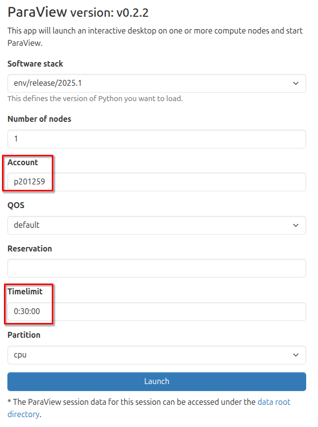
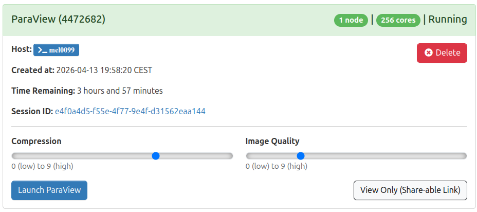
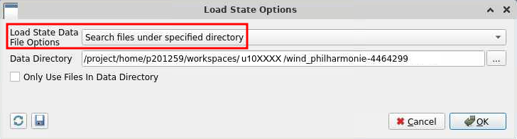

{ width="640" .off-glb }

#  Hands-on: Urban wind simulation and visualization


In this part, you will get a quick overview of a typical High-Performance Computing (HPC) workflow. You will work with a simplified yet realistic example of a Computational Fluid Dynamics (CFD) simulation focusing on the **urban wind patterns around the Philharmonie of Luxembourg**. 

This hands-on workflow is specifically designed for you to practice the essential steps involved in modern scientific computing: accessing the system, submitting parallel jobs, and post-processing large datasets. Through this exercise, you will learn the different ways to interact with and utilize the resources of the [MeluXina supercomputer](https://docs.lxp.lu/system/overview/), gaining practical experience in a real-world HPC environment.
You will proceed to the following steps:

1. [Step 1: Submit a batch job for a parallel CFD simulation and monitor its execution](#submit-of-a-parallel-cfd-simulation-monitor-execution)
2. [Step 2: Visualize and post-process the simulation result interactively](#post-processing-the-simulation-output)
3. [Step 3: Download the final post-processed results on your laptop](#download-the-final-output)

---

## ▶️ Submit of a parallel CFD simulation & monitor execution

The execution of large parallel computing jobs in High-Performance Computing (HPC) environments is almost exclusively performed in **non-interactive mode**, commonly referred to as **batch mode**, utilizing a dedicated submission script. Unlike interactive sessions where a user directly controls the computation in real-time, batch jobs are submitted to a job scheduler (such as Slurm) and placed in a queue. The system then manages the allocation of necessary resources—such as CPU cores, memory, and time—and initiates the execution once the requested resources become available.

This approach offers significant flexibility and efficiency for complex simulations:

- **Resource Optimization**: It ensures that shared computing resources are utilized optimally by running multiple jobs in parallel or sequentially without manual intervention.
- **Decoupling Execution from User Presence**: Crucially, the user does not need to maintain an active connection during the execution phase. This allows heavy computations, which may take minutes or even hours, to proceed in the background without tying up a user's terminal or internet connection.
- **Flexibility**: Jobs can be scheduled to run at any time, including nights, weekends, or periods of lower system load, ensuring that critical research tasks are completed without disrupting active users.

This submission process is initiated and managed via a standard **shell access** environment through a command-line terminal.

### Shell Access

👉 Open a shell on MeluXina supercomputer. 

!!! tip

    You can use your preferred method among the two options configured in the [previous part](connections_meluxina.md):
    
    - [Direct shell access via SSH](connections_meluxina.md#command-line-access-using-ssh)
    - [Shell access via the web-portal](connections_meluxina.md#web-portal-access)

Once connected, you should see the MeluXina welcome banner:

{.center}

### HPC Job Submission

A submission script for Slurm has been prepared for you to easily run this parallel HPC simulation.

👉 Submit the simulation job using the following command:
```bash
sbatch /project/home/p201259/materials/14April_GettingStartedWithMeluXina/wind_philharmonie/run.sh
```

!!! tip "Using the command line"

    To avoid mistake, simply copy the line above and paste it in the MeluXina terminal. Then press `Enter` to execute the command.
    
    If successful, you should see something like this:
    ```
    Submitted batch job 4472627
    ```

??? info "Details of the submission script"

    You can quickly inspect the content of submission script using the `cat` command 🔎
    
    ```bash
    cat /project/home/p201259/materials/14April_GettingStartedWithMeluXina/wind_philharmonie/run.sh
    ```
    

    ```bash linenums="1"
    #!/bin/bash -l
    #SBATCH --job-name WindPhilharmonie                        (1)
    #SBATCH --time 0-00:30:00
    #SBATCH --nodes 1
    #SBATCH --ntasks 16
    #SBATCH --cpus-per-task 1
    #SBATCH --partition cpu
    #SBATCH --qos default
    #SBATCH --account p201259
    #SBATCH --output SLURM_%x_%j.log
    
    echo "== Starting job ${SLURM_JOBID} at $(date)"
    
    # Setup OpenFOAM                                           (2)
    module load env/release/2025.1
    module load OpenFOAM/13-foss-2025a
    source "${FOAM_BASH}"
    
    # Create a new run directory populated with input files    (3)
    RUNDIR="/project/home/p201259/workspaces/${USER}/wind_philharmonie-${SLURM_JOBID}"
    mkdir -p "${RUNDIR}"
    rsync -avzR /project/home/p201259/materials/14April_GettingStartedWithMeluXina/wind_philharmonie/./ "${RUNDIR}"
    echo "Using run directory '${RUNDIR}'"
    cd "${RUNDIR}"
    
    # Set the number of processes in OpenFOAM settings
    foamDictionary -entry numberOfSubdomains -set "${SLURM_NTASKS}" system/decomposeParDict
    
    # Decompose the problem for parallel execution
    time decomposePar -force
    
    # Run the OpenFOAM solver in parallel                      (4)
    time srun -n "${SLURM_NTASKS}" -c 1 foamRun -solver incompressibleFluid -parallel
    
    # Reconstruct output after parallel execution
    time reconstructPar
    
    echo "== Finished job ${SLURM_JOBID} at $(date)"
    ```
    { .annotate }
    
    1. The `#SBATCH` directives specify the configuration of the Slurm job. 
    2. Setup the software environment, in this case we use OpenFOAM.
    3. Prepare simulation input: copy from a template and decompose input for parallel execution
    4. Run the OpenFOAM simulation in parallel

??? example "Running with more processes?"

    You feel playful and want to run the simulation with more parallel processes? 🧑‍🔬
    
    You can specify options on the command line to override the values of the script. For example, you can add `--ntasks 32` to run the simulation with 32 parallel processes: 
    ```bash
    sbatch --ntasks 32 /project/home/p201259/materials/14April_GettingStartedWithMeluXina/wind_philharmonie/run.sh
    ```
    
    Keep in mind that:
    
    - Resources are shared and limited during the training.
    - There are limitations on the number of processes you can run on a single compute node.
    - Using more processes does not systematically mean a faster execution. In this case, reconstructing the parallel output might actually be slower.


### Execution monitoring

Your HPC job is now queued on the MeluXina supercomputer and is waiting for available compute resources. To keep track of its progress, you can monitor its status in real-time using the Slurm command-line interface tool `squeue`. This command lists your active jobs along with key details such as the job ID, the number of resources allocated, the current state of the job, and the node it is running on (or will run on). By running this command periodically, you can verify that your job is accepted by the scheduler, observe its transition from "PENDING" to "RUNNING," and eventually confirm its completion.

👉 Run the `squeue` command to see the status of your job:
```
squeue
```

!!! info "About the job state"

    The output of `squeue` shows information about your current jobs in the queue:
    {.center}
    
    The `STATE` field indicates the current status of the job. It typically goes from:
    ```mermaid
    flowchart LR
        PENDING --> CONFIGURING --> RUNNING
        RUNNING --> COMPLETED
        RUNNING --> FAILED
    ```
    
    After some time, the finished jobs (i.e., `COMPLETED` or `FAILED`) disappear from the list.

👉 Monitor the execution of your job until it is finished. Then you can continue to the next step.


---

## ▶️ Post-processing the simulation output

Once the execution of the simulation is complete, the raw computational data becomes accessible for detailed analysis and interpretation. This transition from raw simulation output to meaningful visual insights is performed interactively using the [ParaView visualization software](https://www.paraview.org/). 

To facilitate this process within the HPC environment, ParaView is launched directly from the MeluXina web-portal, allowing you to interact with the graphical interface in real-time from your local browser. This setup enables you to visualize complex flow fields, such as the urban wind patterns around the Philharmonie, without needing to install heavy software locally, manage complex remote display configurations, or even download the data to your laptop.

### Open ParaView

👉 Start the MeluXina web-portal: [**https://portal.lxp.lu/**](https://portal.lxp.lu/). 

!!! tip

    If needed, follow the instructions of the [previous part](connections_meluxina.md):
    
    - [Web-portal access](connections_meluxina.md#web-portal-access)

👉 Open the **ParaView** application.

1. Click on the [ParaView application on the web-portal](https://portal.lxp.lu/pun/sys/dashboard/batch_connect/sys/bc_meluxina_paraview/session_contexts/new).
2. Use the settings defined below and click the **Launch** button.
{.center}
3. Wait for job to run and then click the **Launch ParaView** button as shown below.
{.center}

You now have the ParaView software running on a remote MeluXina compute node. Its graphical interface is streamed in real time to your laptop via the web browser, allowing you to interact with the visualization locally as if the application were installed on your machine. While the experience is generally smooth, please be aware that high network latency or a busy Wi-Fi connection may introduce slight delays or reduced responsiveness during complex interactions.

### Load the simulation results

Now, open the results of the urban wind simulation in ParaView to explore the simulated wind streamlines, pressure distributions, and velocity fields around the Philharmonie of Luxembourg. This interactive session allows you to inspect the high-resolution data generated by the HPC job, offering a visual insight that would be difficult to grasp from raw numerical output alone.

👉 In the ParaView menu **File**, click on **Load State...**.

{.center}

!!! info "Finding your simulation results"

    - Navigate through your files to locate the results of your simulation. 
    - They should be located in `/project/home/p201259/workspaces/u10XXXX/wind_philharmonie-447ZZZZ`, with
        - `u10XXXX` being your actual username;
        - `447ZZZZ` being the job ID of your submitted job.
    - In this directory, open the file named **`philharmonie.pvsm`**.

Then, make sure to use the settings below and click **OK**.
{.center}

A simple 3D model of the [Place de l'Europe and of the Philharmonie](http://g-o.lu/3/zqKc0) will open. 
It will show the simulated wind streamlines and wind velocity.
You can change the view, zoom-in and zoom-out to explore the simulation output.

{.center}

??? tip "Return to a clean state"

    After many changes, maybe you will want to reset the view. 
    In this case, the easiest is to go in the **Edit** menu and click on **Reset Session**.
    Then you can load the simulation results again to restart from a clean state.

### Create a video of the results

To effectively communicate the dynamic nature of the urban wind simulation, we will generate a video recording that captures the movement of wind streamlines  and velocity fields around the Philharmonie of Luxembourg. This visual summary transforms the static 3D model into an animation, making the complex fluid dynamics easier to interpret and share.

Once you have explored the simulation results, you can create this video directly within the ParaView interface.

👉 In the Paraview menu **File**, click on **Save Animation...**

{.center}

Follow the settings below:

- Remember the directory in which you save the animation.
- Use a meaningful filename, e.g., `philharmonie-wind-meluxina.avi`.
- Select the file type **FFMPEG AVI**.

{.center}

In the animation options, use a frame rate of *5* images per seconds.

{.center}

ParaView will now take a bit of time to generate all the frames of the video and save it.


---

## ▶️ Download the final output

After the animation generation completes, the resulting video file is permanently stored on your MeluXina data storage.
This file remains available for retrieval and can be accessed by using the file explorer provided within the web-portal to navigate through your directories and initiate the download process.

👉 Download the video of the simulation results to your laptop.

In the [MeluXina web-portal](https://portal.lxp.lu/), use the menu **Files** and select **`/mnt/tier2/project/p2021259`** to explore your project directory.

{.center}

Navigate through your files and open the directory that you used earlier to save the animation.

{.center}

Finally, scroll down through the list of files and find the video. Click on the video to download it to your laptop and watch it.

{.center}


---

[{ width="420" }](https://epicure-hpc.eu/) 
[{ width="320" }](https://luxprovide.lu)
